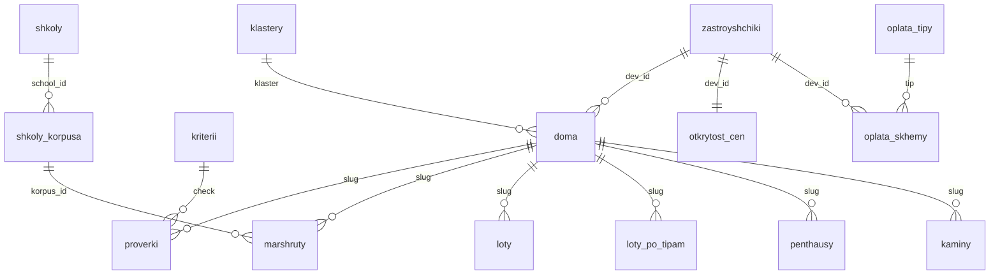

# NOTA: база, логика и решения

Сводное описание на 03.10.2026: как устроена база домов, как из неё считаются выводы и собирается сайт nota.expert, какие решения приняты и что осталось открытым.

Это сводка, а не первоисточник. Если что-то расходится, верить надо в таком порядке:
1. Код: `tools/*.py` в `nota-estate`.
2. Справочные таблицы: `kriterii.csv`, `itog.csv` в `nota-baza`.
3. Документы базы: `nota-baza/README.md` (журнал работ), `SKHEMA.md`, `OBNOVLENIE.md`, `PEREDACHA.md`.

Файл лежит в `data/`, потому что эта папка не выкладывается на хостинг (`deploy/deploy.sh` её исключает). Документ внутренний, на публичный сайт он попасть не должен.

---

## 1. Общая картина

Две папки рядом, обе в `~/Documents/GitHub/`:

| Папка | Что это | Публичность |
|---|---|---|
| `nota-baza` | **Мастер-база**: все дома, факты с источниками, заметки, исходники фото. Руками правим только здесь | закрытая: заметки, контакты отделов продаж, внутренние пометки |
| `nota-estate` | Сайт nota.expert, рабочие страницы для клиентов и агентов, скрипты сборки, **выгрузка** базы в `data/` | сайт — публичный; `data/`, `tools/`, `deploy/` на хостинг не уходят |

Поток данных:

```
nota-baza/*.csv, foto/                     ← правим руками (чаты базы, Suprematore)
   │  tools/klass.py write                 класс NOTA → nota-baza/doma.csv
   │  tools/checks.py write                проверки 01, 04, 05, 09 → nota-baza/proverki.csv
   ▼
tools/build.py
   0. baza.py      выгрузка публичных полей + вычисления → nota-estate/data/*.csv
   1. images.py    обложки 960×600 → img/doma/
   2. doma.py      карточки домов → doma/<slug>/
   3. karta.py     карта и список домов → <main> в karta.html
   4. reytingi.py  рейтинги → reytingi/<slug>/
   5. шапка, подвал, контакты, живые цифры, SEO, sitemap.xml → во все страницы сайта
   ▼
git commit + push  (GitHub — копия и история; GitHub Pages — превью с noindex)
   ▼
bash deploy/deploy.sh go   → FTP на хостинг RU-CENTER (nic.ru) → https://nota.expert
```

Сайт — статический HTML без фреймворков: поисковики и нейросети видят весь текст. Интерактив (фильтры, анкета, «показать ещё») живёт в `js/nota.js`.

---

## 2. Три правила базы

1. **Мастер — в `nota-baza`.** Файлы `nota-estate/data/*.csv`, которые пишет `baza.py`, руками не правим: при следующей сборке они перезапишутся.
2. **Связь — по ключам, не по названиям.**
   - дом — `slug`;
   - застройщик — `dev_id`;
   - школа — `school_id`;
   - корпус школы — `korpus_id`;
   - проверка — `check`.

   Слаг не меняется никогда: на нём держатся связи с сайтом, картинками и проверками.
3. **Факты отдельно от выводов.** В мастер-таблицах только факты, у каждого источник и дата. Класс NOTA, итог паспорта, минуты до лучшей школы, медианы считаются из фактов. Руками их не пишут.

Правила записи фактов (`proverki.csv`):

- **Ответ** — только `да`, `нет`, `нет данных` или `не применяется`.
- **Нет источника — нет факта.** В `source` ставим ссылку или название документа; скриншот можно положить в `istochniki/`.
- **Дата** — в формате `ДД.ММ.ГГГГ`.
- **Старое не затираем.** Новое значение — это новая строка с новой датой; сборка берёт самую свежую.
- **`who`** — кто проверял.
- **`note`** — внутренняя пометка, на сайт не уходит. Через неё ставится красная линия: слова `красная линия` в `note`.
- **Цены** — в рублях без пробелов, например `747000`.

Формат всех CSV: разделитель `;`, кодировка UTF-8 с BOM, чтобы файл открывался в Excel без кракозябр. У `nota-baza/proverki.csv` перевод строки CRLF.

---

## 3. Таблицы мастер-базы (`nota-baza`)



| Файл | Ключ | Строка — это | Объём на 03.10 |
|---|---|---|---|
| `doma.csv` | `slug` | дом (ЖК) | 400 строк. На сайт идут 374: 5 дублей и 21 посёлок Рублёвки не выгружаются |
| `proverki.csv` | `slug` + `check` + `checked` | один факт с доказательством. **Главная таблица** | 5 058 строк, на сайт уходит последняя по каждой паре дом + проверка |
| `kriterii.csv` | `id` | одна из 17 проверок метода | 17 |
| `itog.csv` | `class` | допуск минусов по классу для итога паспорта | 4 |
| `zastroyshchiki.csv` | `dev_id` | застройщик: ИНН, рейтинг ЕРЗ.РФ, сдано за 3 года, остановленные стройки, банкротства | 161 |
| `shkoly.csv` | `school_id` | школа из базы NOTA: индекс, отметка, координаты | 488 (редакция 5, 23.09) |
| `shkoly-korpusa.csv` | `korpus_id` | здание школы, в том числе школы из OSM без оценки (нужны для «ближайшей школы») | 1 869 зданий 1 140 школ |
| `marshruty.csv` | `slug` + `school_id` | пеший путь от дома до ближайшего корпуса школы, до 30 минут | на сайте 4 204 пары |
| `loty/ГГГГ-ММ-ДД.csv` | `slug` | срез предложения: лотов, минимальный лот, медиана | один срез, 23.09 |
| `loty-po-tipam/ГГГГ-ММ-ДД.csv` | `slug` + `tip` | предложение по комнатности: студия, 1, 2, 3, 4+ | срез 23.09, на сайте 1 105 строк |
| `otkrytost-cen.csv` | `dev_id` | открыты ли цены на сайте застройщика | 136 |
| `penthausy.csv` | `pent_id` | пентхаус в продаже; `slug`, если дом есть в базе | 50 |
| `oplata-skhemy.csv` | `scheme_id` | схема оплаты у застройщика | 72 |
| `oplata-banki.csv` | `product_id` | банковский продукт, ставки рынка | 23 |
| `oplata-tipy.csv` | `tip` | справочник типов схем: как работает и во что обходится | 9 |
| `kaminy.csv` | `slug` | дом, где камин заложен проектом | 13 |
| `klastery.csv` | `klaster_id` | кластер района из курса «Элитная Москва» | 20 |
| `obnovleniya.csv` | дата | журнал еженедельных обновлений; отсюда строка «Обновлено …» на карте | 3 записи |

Папки базы:

- `foto/<slug>/` — исходники кадров, главный называется `cover.jpg`;
- `zametki/` — живые заметки: прогулки, просмотры, разговоры с отделами продаж;
- `istochniki/` — выгрузки и скриншоты, на которые ссылаются проверки;
- `nalichie/` — сбор наличия с ЦИАН.

Связки «дом — объект ЕИСЖС», найденные банкротства и прочие промежуточные данные лежат в `istochniki/`.

### Поля `doma.csv`

| Группа | Поля |
|---|---|
| Кто и что | `slug`, `name`, `name_short`, `dev_id`, `developer`, `type` (квартиры / апартаменты / коттеджи / таунхаусы) |
| Класс | `class` (класс NOTA), `class_zayavlen` (как дом позиционирует себя сам), `class_declared` (исходный текст из источников), `class_why`, `class_disputed` |
| Где | `okrug`, `district`, `klaster`, `address`, `lat`, `lon`, `geo_precision` |
| Дом | `units_total`, `units_per_floor`, `floors`, `ceilings_m`, `parking`, `architect`, `facade`, `energy_class`, `escrow`, `maintenance_rub_m2` |
| Сроки | `stage`, `deadline_initial` (по первой декларации), `deadline` (текущий) |
| Цены | `price_from_m2`, `price_median_m2`, `price_check`, `penthouses`, `penthouse_flag` |
| Служебное | `website`, `cian_id` (на сайт не уходит), `sources`, `updated` |

Значения `stage`: анонс · старт продаж · строится · строится, есть сданные · сдан, есть остатки · распродан · дубль.

### Что выгрузка добавляет в `data/doma.csv` (считает `baza.py`)

| Поле | Как считается |
|---|---|
| `p01`…`p09` | последний ответ по каждой проверке паспорта |
| `pasport`, `pasport_why` | итог паспорта и причина (раздел 7) |
| `school_min`, `school_name` | ближайшая любая школа, минут пешком |
| `nota_school_min`, `nota_school_name`, `nota_15` | ближайшая школа из базы NOTA; сколько таких за 15 минут |
| `marked_min`, `marked_name`, `marked_20` | ближайшая школа с отметкой; сколько таких за 20 минут |
| `lots`, `lot_min_m2`, `lot_min_price`, `lots_median_m2`, `lots_date` | последний срез `loty/` |
| `has_foto` | есть ли `foto/<slug>/cover.*` |
| `rynok` | где сейчас купить, по `stage` (раздел 8) |
| `park_m`, `park_name`, `water_m`, `water_name` | парк и вода рядом, разбор текста проверки 02 |

---

## 4. Метод: 17 проверок

**Паспорт** (01–09) делается для всех домов по открытым данным. **Глубокая проверка** (10–17) — для домов в подборке, перед просмотром. ⛔ — стоп-фактор: только у этих проверок бывает красная линия.

| № | Проверка | Что смотрим | Порог «нет» | Откуда |
|---|---|---|---|---|
| 01 | Адрес и класс | попадает ли адрес в ядро своего класса | бизнес — вне старых границ Москвы; премиум — за Третьим кольцом; элит и делюкс — вне ЦАО. Рублёвка и Сколково — «не применяется» | координаты; кольцо ТТК — полигон из `nota-karta-zhk.html` |
| 02 ⛔ | Окружение | что в 500 м: парк и вода (+); промзона, ТЭЦ, МСЗ, магистраль (−) | **красная линия** — ТЭЦ, мусоросжигательный завод (МСЗ) или полигон отходов ≤150 м · минус — промзона от 2 га или крупная магистраль (МКАД, ТТК, хорды, вылетные) ≤150 м | OSM (BBBike + Overpass) |
| 03 | Повседневность | метро, школа, магазины | метро, МЦК или МЦД дальше 15 минут пешком; школа с отметкой — только пометка | OSM, `shkoly.csv` |
| 04 | Плотность | квартир в доме и на этаже | в доме: бизнес >837, премиум >665, элит >100, делюкс >30 · на этаже: бизнес >12, премиум >5, элит и делюкс >3 | декларация, novostroev |
| 05 | Машина | машиномест на квартиру | меньше 0,8 / 1,5 / 2,0 / 2,0 (бизнес / премиум / элит / делюкс) | декларация, сайты, агрегаторы |
| 06 ⛔ | Застройщик | рейтинг ЕРЗ.РФ по срокам, остановки, банкротства | **красная линия** — остановленная стройка или банкротство за 3 года · минус — рейтинг ЕРЗ ниже 3,0 · нет рейтинга — «нет данных» | ЕРЗ.РФ, ЕИСЖС, ЕФРСБ |
| 07 | Сроки дома | перенос ввода | перенос больше 6 месяцев между первой и текущей декларацией (или срок прошёл, а дом не сдан); при нескольких корпусах берётся худший | наш.дом.рф |
| 08 ⛔ | Юридика | квартиры или апартаменты, эскроу, документы | **красная линия** — нет эскроу или продажи мимо ДДУ · минус — апартаменты (в том числе в сданных домах) | наш.дом.рф |
| 09 | Цена против класса | цена метра против медианы класса в районе | дороже медианы класса в районе больше чем на 30% (если в районе ≥3 дома класса) или «цена не бьётся с классом» | `doma.csv` |
| 10 | Что построят рядом | ППТ и разрешения в 500 м | — | mos.ru |
| 11 | Соседи | доля студий и однушек | — | планировки, прайс |
| 12 | Архитектура и материалы | архитектор, Архсовет, фасад, остекление | — | сайт, Архсовет |
| 13 | Квартиры | потолки, окна, террасы | потолки: бизнес от 2,8 м, премиум от 3,2 м, элит и делюкс от 3,3 м | планировки, декларация |
| 14 | Двор и общие зоны | двор без машин, лобби, кладовые | — | генплан |
| 15 | Климат и воздух | вентиляция, кондиционирование, водоподготовка | — | декларация, застройщик |
| 16 | Содержание | ₽/м² в месяц и что входит | — | управляющая компания |
| 17 | Ликвидность | конкуренция лотов, скорость продаж, аренда | — | ЦИАН, `loty/` |

Кто какие проверки заполняет:

| Проверки | Кто считает | Как |
|---|---|---|
| 01, 04, 05, 09 | автоматически, `tools/checks.py write` | по `doma.csv` (раздел 6) |
| 02, 03 | в облачной сессии Claude | по OpenStreetMap |
| 06, 07, 08 | вручную, чаты базы | по ЕРЗ.РФ, ЕИСЖС (наш.дом.рф), ЕФРСБ |
| 10–17 | — | на сайте пока не используются |

---

## 5. Класс NOTA: два класса (`tools/klass.py`)

У дома два класса:

- **`class_zayavlen`** — как дом позиционирует себя сам, одним словом: бизнес, премиум, элитный или делюкс.
  - Берётся из текста `class_declared`.
  - Если источники расходятся, остаётся тот вариант, что уже был классом базы.
  - Если поле уже заполнено (в том числе поправлено руками), скрипт его не трогает.
- **`class`** — **класс NOTA**. По нему считаются все нормы и паспорт.

Алгоритм:

1. За основу берётся заявленный класс. Если заявлен «комфорт», дом считается бизнесом: в базе держим от бизнеса.
2. Сверяем с нормами класса по четырём жёстким признакам:

   | Признак | Бизнес | Премиум | Элит | Делюкс |
   |---|---|---|---|---|
   | Адрес | старые границы Москвы (9 округов) | внутри ТТК | ЦАО | ЦАО |
   | Плотность, квартир в доме | ≤837 | ≤665 | ≤100 | ≤30 |
   | Паркинг, мест на квартиру | ≥0,8 | ≥1,5 | ≥2,0 | ≥2,0 |
   | Потолки | ≥2,8 м | ≥3,2 м | ≥3,3 м | ≥3,3 м |

   Медианы 837 и 665 — типичный дом своего класса по базе. Для Рублёвки и Сколкова признак адреса не применяется.
3. **Два промаха и больше** — класс понижается на одну ступень. **Один промах** — класс остаётся, промах идёт минусом в паспорт. **Вверх класс не поднимается.**
4. Ручные решения по классу зашиты в скрипте (`OVR`):
   - `mod`, `simfoniya-34`, `pride` — премиум;
   - `preobrazhenskaya-ploschad` — бизнес.
5. Пишутся `class_why` («понижен: … — адрес, плотность» или «минус к классу: …») и `class_disputed` = «да», если классы разные.

Результат на сайте (374 дома):

| Класс NOTA | Домов |
|---|---|
| бизнес | 245 |
| премиум | 55 |
| элит | 44 |
| делюкс | 30 |

У 127 домов класс NOTA ниже заявленного.

---

## 6. Автоматические проверки (`tools/checks.py`)

Скрипт читает `nota-baza/doma.csv` и дописывает в `nota-baza/proverki.csv` новые строки. Строка добавляется, только если ответ или значение поменялись. Дата проставляется сегодняшняя по Москве, `who` = Claude. Файл пишется с CRLF.

- **01** — адрес против класса NOTA, правила из таблицы выше. Премиум проверяется попаданием точки в полигон ТТК.
- **04** — квартир в доме и на этаже против норм.
  - У посёлков Рублёвки и Сколкова «не применяется»: в `units_total` у них число домов.
  - Если неизвестно ни одно, ни другое — «нет данных».
- **05** — машиномест на квартиру против нормы. У посёлков «не применяется».
- **09** — `price_from_m2` против медианы того же класса в том же районе.
  - Если в районе меньше 3 домов класса — «да» с пометкой «сверка с медианой по базе».
  - Если в `price_check` записано «не бьётся» — «нет».

Порядок пересчёта всегда такой: сначала `klass.py write`, затем `checks.py write`. Проверки 01 и 09 зависят от класса.

---

## 7. Итог паспорта: «Отметка» / «Присмотреться» / «Без отметки»

Считает `baza.py → pasport()` при каждой сборке по последним ответам 01–09 и классу NOTA.

1. **Красная линия** → «Без отметки». Срабатывает, только если ответ «нет» и в `note` стоит `красная линия`, и только у проверок 02, 06, 08. «Нет» без пометки — обычный минус.
2. **Мало данных.** Если известно (да/нет) меньше 4 проверок из 9 — «Присмотреться» с пометкой «мало данных». На сайте такой дом показан как «Проверяем».
3. **Иначе считаем минусы** — ответы «нет» среди известных — и сравниваем с допуском класса из `itog.csv`. Чем выше класс, тем строже:

   | Класс | «Отметка» | «Присмотреться» | «Без отметки» |
   |---|---|---|---|
   | Бизнес | до 2 минусов | 3 минуса | с 4 минусов |
   | Премиум | до 1 минуса | 2 минуса | с 3 минусов |
   | Элит | без минусов | 1–2 минуса | с 3 минусов |
   | Делюкс | без минусов | 1–2 минуса | с 3 минусов |

На сайте сейчас (сборка 03.10, 374 дома) 156 «Отметка», 144 «Присмотреться» (включая «мало данных»), 74 «Без отметки». Красная линия у 9 домов.

Пометка «минус, не красная линия» красной линией не считается: `baza.py → is_red()` (исправлено 03.10, до этого 33 дома с такой пометкой ошибочно стояли «Без отметки»).

Допуск откалиброван так, чтобы дома делились примерно на трети. Пересматривать его стоит, когда соберём больше проверок, а не при каждом пересчёте. Таблица допуска на странице «Метод» собирается из `itog.csv` автоматически.

На сайте паспорт — девять клеток («пипсы»):

| Клетка | Ответ |
|---|---|
| чёрная | да |
| красная | нет |
| пустая | проверяем |

---

## 8. Рынок дома и что не попадает на сайт

| `stage` | `rynok` | На карте |
|---|---|---|
| старт продаж, строится | первичка | У застройщика |
| строится, есть сданные; сдан, есть остатки | первичка и вторичка | Застройщик и вторичка |
| распродан | только вторичка | Только вторичка |
| анонс | анонс | Анонс, продаж нет |

На сайт не выгружаются:

- строки `stage = дубль`: их держим в базе ради связей;
- посёлки, у которых `type` = коттеджи или таунхаусы (решение 24.09);
- папки `zametki/` и `istochniki/`;
- поля `who`, `note`, `cian_id`;
- контакты отделов продаж и непубличные условия.

---

## 9. Школы

**База школ** (`shkoly.csv`, 488 организаций): городские 421, частные 32, спортивные 24, при вузах 11.

**Индекс NOTA** — баллы от 0 до 100. Источники и вес каждого:

| Источник | Вес |
|---|---|
| Всероссийская олимпиада 2026: 3 балла за победителя, 0,7 за призёра, ещё 3, если были дипломы в 2025 | до 25 |
| Грант Мэра Москвы 2025/26: от 35 баллов за первую двадцатку до 4 за места 301–400 | до 35 |
| RAEX, частные школы России (частным заменяет городской грант) | до 40 |
| RAEX, поступление в ведущие вузы | до 20 |
| RAEX, отраслевые рейтинги | до 14 |
| RAEX, масштаб подготовки и топ-100 России | до 18 |
| Узкие городские профильные проекты: «Математическая вертикаль», академкласс, медиакласс | до 14 |
| Forbes Education, частные школы | до 6 |

Спортивные школы отметку не получают: их меряют разрядами.

**Ступени:**

| Ступень | Баллы | Школ |
|---|---|---|
| Отметка NOTA | 40 и выше | 48 |
| На заметку | 25–39 | 54 |
| Лучшая в районе | ниже 25, но сильнейшая там, где в районе нет школ уровня выше | 71 |

Остальные школы без пометки.

**Пешие маршруты** считаются в облачной сессии Claude, скриптами `tools/marshruty/`. Порядок пересчёта описан в `tools/marshruty/README.md`, цифры и ограничения — в `data/marshruty-shkoly.md`.

- **Сеть** — пешеходный граф OpenStreetMap: тротуары, переходы, дворы. Без магистралей, частных и закрытых территорий.
- **Точки** — все корпуса школы, а не одна; для школы берётся ближайший к дому корпус.
- **Расчёт** — алгоритм Дейкстры, скорость 75 м/мин (4,5 км/ч), без светофоров, лимит 3,9 км (около 30 минут).
- **Подходы к сети** не идут через железную дорогу, воду или магистраль.

**Где используется:**
- блок «Школы рядом» в карточке дома;
- поля `school_min`, `nota_school_min`, `marked_min` в выгрузке;
- рейтинг «Школы Москвы»;
- карта `shkoly-marshruty.html`.

---

## 10. Цены, лоты, оплата

- **`price_from_m2`** — «цена от» за м². Обновляется, если цена изменилась больше чем на 3% и есть источник. От неё зависит проверка 09 и медианы по классам на сайте: в медианы не входят Рублёвка и Сколково.
- **`loty-po-tipam`** — «Что в продаже» по комнатности, в карточке дома и на карте.
  - `cena_ot` — текущая цена со скидкой застройщика, `cena_ot_bez_skidki` — зачёркнутая.
  - Цена выводится в млн ₽, площадь в м².
  - Сайт берёт самый свежий файл среза.
- **`otkrytost-cen`** — открыта ли цена у застройщика: открыто, частично, по запросу, нет своего сайта или не удалось проверить.
- **`oplata-*`** — схемы оплаты: субсидированная ставка, траншевая ипотека, рассрочки, скидка за 100%, trade-in и другие. Справочник «как работает и во что обходится» лежит в `oplata-tipy.csv`.

---

## 11. Прочие справочники и подборки

- **Пентхаусы** (`penthausy.csv`) — рейтинг `reytingi/penthausy-moskvy/`. 25.09 в базу заведены 22 дома, у которых в рейтинге были пентхаусы.
- **Дома у парка и воды** — рейтинг `reytingi/doma-u-parka-i-vody/`: дома в 300 м от парка (от 1 га) или воды. Расстояния берутся из проверки 02 (OSM, по прямой).
- **Камины** (`kaminy.csv`) — список и мини-карта в разборе «Камин в квартире». Чтобы добавить дом, нужна строка в `kaminy.csv`, а дом должен быть в `doma.csv`.
- **Апартаменты** — список в разборе «Апартаменты или квартира» собирается сам, из проверки 08 со словом «апартаменты» в значении.
- **Кластеры** (`klastery.csv`, колонка `klaster`) — 20 кластеров из курса «Элитная Москва», к ним привязаны 42 дома.
  - Территория кластера — точки в 350 м от его домов и ориентиров; между соседями полоса 60 м.
  - **На сайте выключены** (`KLASTERY = False` в `tools/karta.py`) до карты кластеров от автора курса.

---

## 12. Сборка сайта (`python3 tools/build.py`)

### Что генерируется, а что правится руками

| Что | Как |
|---|---|
| `doma/<slug>/`, `doma/index.html` | генерирует `doma.py`. **Руками не править** |
| `<main>` в `karta.html` | генерирует `karta.py` |
| `reytingi/<slug>/` | генерирует `reytingi.py`. Хаб `reytingi.html` — руками |
| шапка, подвал, блок контактов | из `tools/partials/*.html` во все страницы сайта |
| телефон, почта, Telegram, MAX, офис, реквизиты ИП, коды Вебмастера и Search Console | `tools/site.json` |
| какие дома получают карточку, текст «На заметку» и «Что проверить» | `tools/doma.json` (36 домов) |
| страницы-переадресации `nota-index.html`, `index-2026-08.html`, `index-2026-09.html` | пишет сборка (`MOVED`) |
| `sitemap.xml`, `robots.txt` | пишет сборка |
| разборы, главная, «Метод», «Подбор», «Сценарии» | правятся руками, кроме вставок ниже |
| клиентские страницы `nota-*` | сборка их **не трогает** |

### Живые цифры

Числа, которые меняются вместе с базой, руками в страницах не пишем. В текст ставим метку, сборка подставит число и слово в нужной форме:

```html
<!--n:{doma} {doma:дом|дома|домов}-->374 дома<!--/n-->
<meta name="description" content="…" data-n="… {doma} {doma:дом|дома|домов} в базе …">
```

Ключи задаются в `numbers()` в `build.py`:

| Ключ | Что это |
|---|---|
| `doma` | домов на сайте |
| `biz`, `prem`, `elit`, `dlx` | домов по классам |
| `spor` | домов со спорным классом |
| `med_biz` … `med_dlx` | медиана «цены от» по классу |
| `v_prodazhe` | домов с данными о предложении |
| `kartochki` | карточек домов |
| `otm`, `prism`, `bez`, `malo` | итоги паспорта |
| `kamin`, `apart` | домов с камином и с апартаментами |
| `srez` | дата среза базы |
| `dopusk` | допуск минусов словами |
| `shkoly`, `shkoly_mark`, `shkoly_zam`, `pent`, … | цифры рейтингов |

### Вставки между метками

| Метки | Что вставляется | Страница |
|---|---|---|
| `<!--itog-t-->` … `<!--/itog-t-->` | таблица допуска | `metod.html` |
| `<!--baza-t-->` | таблица-пример домов | `index.html` |
| `<!--karta-band-->` | полоса карты | `index.html` |
| `<!--apart-l-->` | список домов с апартаментами | разбор «Апартаменты или квартира» |
| `<!--kamin-l-->` | список домов с камином | разбор «Камин в квартире» |
| `<!--rekv-->` | реквизиты | `politika.html` |
| `<script id="ld-faq">` | разметка FAQ, собирается из вопросов на странице | страницы с FAQ |

### SEO и кэш

- **Канонический адрес и `og:url`** ведут на `https://nota.expert`. Картинки превью прописываются полным адресом.
- **Метка `data-preview`** — это `noindex`: она закрывает копию на GitHub Pages от поисковиков. `deploy.sh` вырезает её при выкладке; если метка где-то осталась, выкладка останавливается.
- **Сброс кэша.** К `css/nota.css`, `js/nota.js` и фото команды дописывается `?v=<хеш>`: хостинг отдаёт их без правил кэша.
- **Обложки домов** собираются цепочкой:
  1. `nota-baza/foto/<slug>/cover.*`;
  2. `img/_src/doma/` (в git не идёт);
  3. `images.py`: кадр 960×600, JPEG качества 80;
  4. `img/doma/<slug>.jpg`.

---

## 13. Выкладка

1. Правки коммитятся и отправляются на GitHub (`slavasupersky-cmyk/nota-estate`, ветка `main`). Удобнее всего через GitHub Desktop.
2. `bash deploy/deploy.sh` показывает, что изменилось; `bash deploy/deploy.sh go` выкладывает.
   - Выкладывает по FTP на хостинг RU-CENTER (nic.ru) только изменённые файлы.
   - Пароль хранится в `~/.netrc`, нужен установленный `lftp`.
   - Список уже выложенного хранится на том Mac, с которого выкладывали (`~/.cache/nota-deploy/manifest.txt`). С другого компьютера первый запуск перезальёт сайт целиком.
3. **Не выкладываются:**
   - `.git*`, `README.md`;
   - `Claude outputs/`, `tools/`, `data/` (кроме `data/doma.csv` — на неё ссылается разбор о классах);
   - `img/_inbox/`, `_to_delete/`, `deploy/`.

   `.htaccess` для хостинга берётся из `deploy/.htaccess`.

---

## 14. Еженедельное обновление (`nota-baza/OBNOVLENIE.md`)

**Когда.** Задача по расписанию, каждый понедельник с 15:00 по Москве. Если компьютер был закрыт, она догоняет позже на той же неделе. Защита от повторного запуска — файл `obnovlenie.lock`.

1. **Собрать новости рынка за неделю.** Только бизнес-класс и выше: Москва в старых границах, Сколково, многоквартирные дома Рублёвки.
   - новые ЖК — новая строка в `doma.csv` и в `foto-istochniki.csv`;
   - переносы, смена застройщика, банкротства, сдачи, распродажи — меняются `stage` и `deadline`, факты идут новыми строками 06–08;
   - дубли — `stage = дубль`;
   - добор из наш.дом.рф: квартиры, машиноместа, потолки;
   - «цена от», если она изменилась больше чем на 3%.
2. **Пересчитать** в `nota-estate`:
   1. `klass.py write`;
   2. `checks.py write`;
   3. строка в `obnovleniya.csv`;
   4. `build.py`.
3. **Отчёт** Suprematore: что добавлено, убрано и изменено, новые красные линии, что на решение, напоминание закоммитить обе папки.

**Правила среды:**
- git из оболочки не запускать — однажды остался `.git/index.lock`;
- файлы не удалять, а переносить в `_to_delete/`;
- клиентские страницы `nota-*` не трогать.

---

## 15. Журнал решений

| Дата | Решение |
|---|---|
| 20.09 | Сайт без сборщиков и зависимостей; тяжёлое (рендеры, видео, архивы, `_src/`) в git не кладём — `.gitignore` |
| 23.09 | Мастер-база вынесена в `nota-baza`; сайт берёт только публичную выгрузку (`baza.py`, первый шаг сборки) |
| 23.09 | Метод: 17 проверок, паспорт из 9; стоп-факторы 02, 06, 08; красная линия — только по явной пометке в `note` |
| 23.09 | Два класса: заявленный и NOTA; понижение на одну ступень при двух и более промахах из четырёх (адрес, плотность, паркинг, потолки); вверх не поднимаем |
| 23.09 | 06: красная линия — банкротство только спецзастройщика дома или головной компании; банкротства прочих юрлиц группы — справка в `value`. Нет рейтинга ЕРЗ — «нет данных», а не «да» |
| 23.09 | 07: «нет» — перенос больше 6 месяцев; при нескольких корпусах берётся худший; сданные дома — «да» |
| 23.09 | 08: дом на старых ДДУ с Фондом защиты дольщиков (Прайм Парк) — минус, не красная линия. Сданные апартаменты — «нет» без пометки. Тип (квартиры или апартаменты) — по наш.дом.рф. Неполный пакет документов — не красная линия. Квартиры плюс нежилые корпуса в одном ЖК — не минус |
| 23.09 | Платная бронь без проектной декларации — продажа мимо ДДУ, красная линия (Аристарховский) |
| 23.09 | Дубли не держим: `a22` = `danilovskiy-ot-granel`, `sreda-na-lobachevskogo` = `nativ` (`stage = дубль`) |
| 23.09 | Допуск смягчён: элит и делюкс «Без отметки» с 3 минусов (было с 2) |
| 24.09 | Потолки для элита и делюкса — 3,3 м (как в `kriterii.csv`) |
| 24.09 | Посёлки Рублёвки и Сколкова: 04 и 05 «не применяется», а затем посёлки (21) **убраны с сайта**, в базе остаются |
| 24.09 | Квартиры на этаже входят в 04. Калибровка: норма для бизнеса 12 на этаже (было 8), допуск бизнеса «Отметка» до 2 минусов, «Без отметки» с 4 |
| 24.09 | Машиноместа не ждать от ЕИСЖС — брать с сайтов застройщиков и агрегаторов, только явную цифру на весь ЖК |
| 24.09 | Кластеры районов заведены в базе, на сайте выключены до карты от автора курса |
| 25.09 | В базу добавлены 22 дома из рейтинга пентхаусов; заведена таблица каминов |
| 28.09 | Первое еженедельное обновление по расписанию; дата строк в `checks.py` берётся сама |
| 02.10 | Проверки 06–08 для 24 домов без строк; новая красная линия — `knightsbridge-private-park` (банкротство застройщика) |
| 03.10 | Исправлена сборка: пометка «минус, не красная линия» больше не считается красной линией (33 дома вернулись из «Без отметки») |

---

## 16. Открытые вопросы (на решение Suprematore)

Полные списки — в `nota-baza/README.md`, разделы «Обновление 24.09», «Обновление 28.09», «Проверки 06–08 … (02.10)». Главное:

- **Привязки и дубли.**
  - `vorobev-dom` заведён не на тот дом, что в рейтинге пентхаусов.
  - `tessinskiy-v` и `annabel-s` — стадия в базе расходится с ЕИСЖС.
  - `khilkov` — сайт в базе про соседний дом.
- **Застройщики.**
  - `duo`: Hutton вышел, новый девелопер не назван.
  - Не совпадают с реестрами у `magnum-khamovniki`, `usadba-trubetskih`, `bolshaya-nikitskaya-45`, `kutuzovskaya-rivera`.
  - Возможные красные линии: `chetyre-solntsa` и `cloud-nine`. Не проверены, потому что ЕФРСБ не открылся.
  - Сигналы рисков по Самолёту, Таширу, СберСити в 06–07 не внесены.
- **Сроки.**
  - Не видно ввода у домов со сроком III кв. 2026 (`shelepikha`, `soyuz`, `legasi`, `opus`, `krasnyy-oktyabr`, `kamerger`, `vernissage` и другие).
  - Расхождения у `indivo`, `tatum`, `rakurs`.
- **Классы.** Fairmont Vesper (от бизнеса до делюкса по разным источникам), Кутузовская Ривьера, `demidov-26`.
- **Типы.** `gorod-yakht`, `presnya-siti` — апартаменты или квартиры.
- **Новые площадки без класса:** «Дом Высоты» на месте завода «МиГ», River City (Element и ПИК), Профсоюзная, з/у 76А.
- **Платная бронь** у `zolotye-krylya`: если подтвердится — красная линия.
- **Обложки:** около 28 домов без картинки; у «Правды» и «Вавилова 64» кадры ещё не скачаны.

---

## 17. Известные расхождения и долги

1. **Сборка 03.10 ещё не выложена.** Сайт пересобран с правками базы от 01–02.10 и исправлением красной линии. Осталось закоммитить и выложить (`deploy.sh go`).
2. **В `kriterii.csv` у проверки 04** записано «бизнес ≤8 на этаже», а действует 12 (решение 24.09; `checks.py`, `doma.py`). Таблицу стоит поправить. Иначе её текст на сайте и в базе расходится с расчётом.
3. **Раздел «Итог паспорта» в `nota-baza/README.md`** описывает допуски до калибровки 24.09. Действующие допуски — в `itog.csv` (таблица в разделе 7 этого файла).
4. **`SKHEMA.md` говорит, что `stage = распродан` на сайт не выводить**, а `baza.py` выводит такие дома с пометкой «только вторичка». Так сделано намеренно (решение по рынку дома от 23.09), `SKHEMA.md` устарела в этой строке.
5. **`klass.py` и `checks.py`** ищут базу по жёсткому пути `../nota-baza/`. Переменную `NOTA_BAZA` понимает только `baza.py`.
6. **Маршруты до школ.**
   - `tools/marshruty/` считает от старого файла домов `data/zhk-moskva-biznes-plus-geo.csv` (288 домов). Для домов, добавленных позже, маршруты дописывались отдельно в облаке.
   - У двух домов от 24.09 маршрутов нет.
   - Цифры в `data/marshruty-shkoly.md` — по 288 домам.
7. **README сайта** описывает публикацию через GitHub Pages, а сайт фактически выкладывается по FTP на nic.ru (раздел 13).
8. **`tools/site.json`:** `max_url` — заглушка `#`, коды Яндекс Вебмастера и Google Search Console пустые.
9. **Мусор на диске:** `_to_delete/` в обеих папках, архивы в `img/_src/` и `deploy/nota-expert-site.zip`. В git это не попадает, но место занимает.

---

## 18. Где что править

| Хочу | Правлю | Потом |
|---|---|---|
| добавить или поменять дом | `nota-baza/doma.csv` (новый `slug` латиницей, не менять существующие) | `klass.py write` → `checks.py write` → `build.py` |
| внести факт проверки | новая строка в `nota-baza/proverki.csv` (старые не трогать) | `build.py` |
| поставить красную линию | ответ «нет» + `красная линия` в `note` (только 02, 06, 08) | `build.py` |
| поменять нормы класса | `klass.py` (`UN`, `PARK`, `CEIL`), `checks.py` (`UPF`), текст — `kriterii.csv`, `doma.py` (`UNITS_NORM`) | пересчёт всей цепочки |
| поменять допуск итога | `nota-baza/itog.csv` | `build.py` |
| поменять стадию или рынок | `stage` в `doma.csv` | `build.py` |
| обложку дома | `nota-baza/foto/<slug>/cover.jpg` | `build.py` |
| текст «На заметку» в карточке | `tools/doma.json` | `build.py` |
| контакты, реквизиты, коды | `tools/site.json` | `build.py` |
| шапку или подвал | `tools/partials/` | `build.py` |
| пересчитать маршруты до школ | облачная сессия, `tools/marshruty/README.md` | `build.py` |
| выложить | — | коммит + push → `bash deploy/deploy.sh go` |
